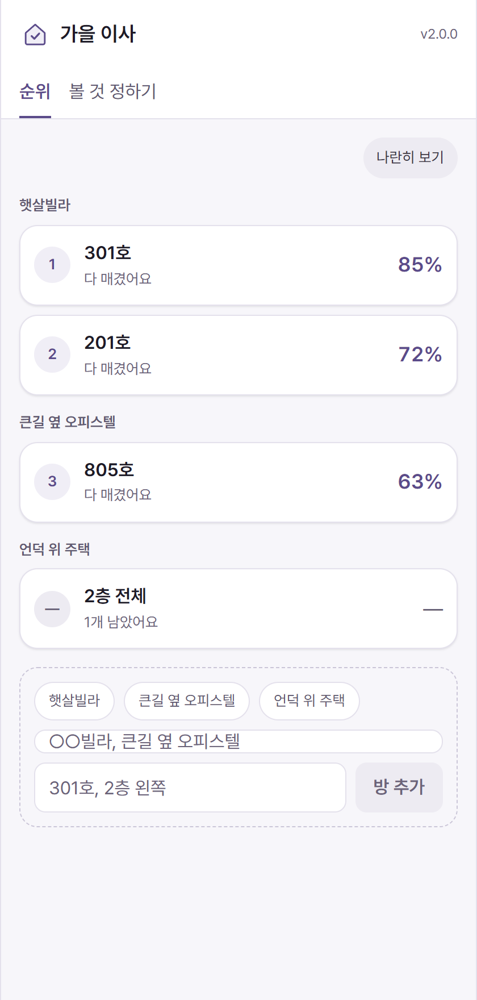

<a id="readme-top"></a>

[![Contributors][contributors-shield]][contributors-url]
[![Forks][forks-shield]][forks-url]
[![Stargazers][stars-shield]][stars-url]
[![Issues][issues-shield]][issues-url]
[![MIT License][license-shield]][license-url]

<br />
<div align="center">
  <a href="https://github.com/dev1f965x/borogayo">
    
  </a>

  <h3 align="center">보러가요</h3>

  <p align="center">
    Score every place you visit against the same criteria, and read the rooms back in order.
    <br />
    <a href="https://dev1f965x.github.io/borogayo/">Open it »</a>
    ·
    <a href="docs/product.md">Explore the docs</a>
    ·
    <a href="https://github.com/dev1f965x/borogayo/releases">Download</a>
    ·
    <a href="https://github.com/dev1f965x/borogayo/issues/new?labels=bug">Report Bug</a>
    ·
    <a href="https://github.com/dev1f965x/borogayo/issues/new?labels=feature">Request Feature</a>
  </p>
</div>

<details>
  <summary>Table of Contents</summary>
  <ol>
    <li>
      <a href="#about-the-project">About The Project</a>
      <ul>
        <li><a href="#built-with">Built With</a></li>
      </ul>
    </li>
    <li>
      <a href="#getting-started">Getting Started</a>
      <ul>
        <li><a href="#prerequisites">Prerequisites</a></li>
        <li><a href="#installation">Installation</a></li>
      </ul>
    </li>
    <li><a href="#usage">Usage</a></li>
    <li><a href="#roadmap">Roadmap</a></li>
    <li><a href="#license">License</a></li>
    <li><a href="#contact">Contact</a></li>
    <li><a href="#acknowledgments">Acknowledgments</a></li>
  </ol>
</details>

## About The Project

<div align="center">
  
</div>

Several viewings over a few days blur together, and the reason one place was ruled out
goes with them. Estate agents' apps list what is available; none of them records what the
viewer thought of a place while standing in it.

- **Criteria are set once, up front**, before the first viewing, and are the same for every
  place. Each carries a weight from 1 to 5.
- **Each criterion is answered where it belongs.** Transit and parking are the same for
  every unit in a building and are answered once per building; light and water pressure are
  answered per room.
- **One tap per criterion**, saved as it is entered. A criterion that cannot be judged in
  the room is marked **해당 없음** and is excluded from that room's total rather than
  holding it back.
- **The ranking** is by weighted percentage, with a building's adjacent rooms under one
  header. A room with anything open shows `—` and ranks below every finished one.
- **Side by side** compares two or three rooms criterion by criterion.
- **Photos** are re-encoded on the device as they are taken, which resizes them and drops
  every EXIF field, including the GPS position.
- Everything stays on the device. No account, no sync, no analytics.

<p align="right">(<a href="#readme-top">back to top</a>)</p>

### Built With

[](https://tauri.app/)
[](https://www.rust-lang.org/)
[](https://react.dev/)
[](https://www.typescriptlang.org/)
[](https://vite.dev/)
[](https://playwright.dev/)
[](https://vitest.dev/)
[](https://biomejs.dev/)
[](https://docs.github.com/actions)

<p align="right">(<a href="#readme-top">back to top</a>)</p>

## Getting Started

### Prerequisites

Nothing, to use it in a browser.

To build it: [Node.js](https://nodejs.org) 24, [Rust](https://rustup.rs) stable, and the
[Tauri prerequisites](https://tauri.app/start/prerequisites/) — plus the Android SDK and
NDK for the APK.

### Installation

- **Web** — <https://dev1f965x.github.io/borogayo/>. Nothing to install, and it keeps
  working offline once loaded.
- **Android** — the `.apk` from the
  [latest release](https://github.com/dev1f965x/borogayo/releases/latest). Android asks
  once for permission to install an app from outside the Play Store.

The two are separate hunts: what is scored on the phone stays on the phone (ADR 5).

From source:

```sh
git clone https://github.com/dev1f965x/borogayo.git
cd borogayo
npm install
npm run dev                # the page
npm run tauri android dev  # the app, on a phone or an emulator
```

<p align="right">(<a href="#readme-top">back to top</a>)</p>

## Usage

1. Start a hunt and set the criteria in **볼 것 정하기**. Twelve are there to begin with;
   however they are left is what the next hunt starts from.
2. At a viewing, add the building and the room, then answer each criterion with one tap.
   **해당 없음** is for what cannot be judged there.
3. **순위** ranks every room once nothing is left open. A room still being scored shows how
   many answers are missing.
4. **나란히 보기** compares two or three rooms, marking the better answer in each row.

The interface is in Korean.

### Coming from 1.0.0

This is the same app written again. The version is 2.0.0 and it installs over 1.0.0 without
a reinstall, but nothing carries across: the old hunts were in a SQLite database this
version cannot read (ADR 3). Video waits for 2.1.0 (ADR 6).

<p align="right">(<a href="#readme-top">back to top</a>)</p>

## Roadmap

- [x] 2.0.0 — criteria, scoring, the ranking, side by side, photos, on web and Android
- [ ] 2.1.0 — video of a walk-through on Android, with its location stripped
- [ ] later — a hunt shared with whoever is moving too, if sync ever earns an account

See the [open issues](https://github.com/dev1f965x/borogayo/issues) for the full list.

<p align="right">(<a href="#readme-top">back to top</a>)</p>

## License

Distributed under the MIT License. See [`LICENSE`](LICENSE).

<p align="right">(<a href="#readme-top">back to top</a>)</p>

## Contact

[@dev1f965x](https://github.com/dev1f965x) — https://github.com/dev1f965x/borogayo

<p align="right">(<a href="#readme-top">back to top</a>)</p>

## Acknowledgments

- [Pretendard](https://github.com/orioncactus/pretendard) — SIL Open Font License 1.1, see [`licenses/`](licenses)
- [Shields.io](https://shields.io)
- [Best-README-Template](https://github.com/othneildrew/Best-README-Template)

<p align="right">(<a href="#readme-top">back to top</a>)</p>

[contributors-shield]: https://img.shields.io/github/contributors/dev1f965x/borogayo.svg?style=for-the-badge
[contributors-url]: https://github.com/dev1f965x/borogayo/graphs/contributors
[forks-shield]: https://img.shields.io/github/forks/dev1f965x/borogayo.svg?style=for-the-badge
[forks-url]: https://github.com/dev1f965x/borogayo/network/members
[stars-shield]: https://img.shields.io/github/stars/dev1f965x/borogayo.svg?style=for-the-badge
[stars-url]: https://github.com/dev1f965x/borogayo/stargazers
[issues-shield]: https://img.shields.io/github/issues/dev1f965x/borogayo.svg?style=for-the-badge
[issues-url]: https://github.com/dev1f965x/borogayo/issues
[license-shield]: https://img.shields.io/github/license/dev1f965x/borogayo.svg?style=for-the-badge
[license-url]: https://github.com/dev1f965x/borogayo/blob/main/LICENSE
